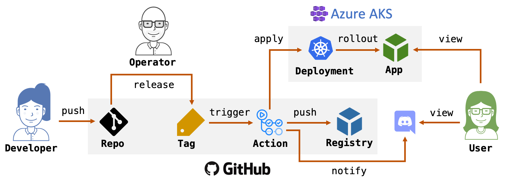

# Continuous deployment demo using GitHub actions

> This demo assumes yoo already have a Kubernetes cluster configured with Dapr. If not, consider the opinionated Dapr install in [dapr-demos/setup](https://github.com/mchmarny/dapr-demos/tree/master/setup).



## Demo

To walk-through the demo steps, start by navigating to the the already deployed app and take a note of the release version and the deployment time (in UTC):

https://gitops.thingz.io/

### Edit code

Next, edit the `staticMessage` variable in [app/main.go](app/main.go) to simulate developer making code changes:

> Make sure to save your changes

```go
const (
  greetingsMessage = "hello PDX"
)
```

Now, increment the version number variable (`APP_VERSION`) in the [app/Makefile](app/Makefile):

```shell
APP_VERSION ?=v0.1.5 # was v0.1.4
```

### Sync changes

Add, commit, and push your local changes upstream:

```shell
make sync
```

This will `git add`, `git commit`, and `git push` your changes to GitHub

### Create a release tag

When ready to make a release, tag it and push the tag to GitHub:

```shell
make tag
```

This will `git tag` it and `git push origin` your version tag to trigger to pipeline

> Note, the GitHub pipeline takes about ~2 min from the time you tag it to when the new app is deployed. To monitor the results either check the [GitHub notifications](https://github.com/notifications) or watch the action execute the [individual steps](https://github.com/mchmarny/git-ops/actions?query=workflow%3A%22git-ops+release+on+tag%22) although that link will depend on your GitHUb username (e.g. `mchmarny` above).

### View it

Once the pipeline is finished, you navigate again to the app. 

https://gitops.thingz.io/

If everything went well, the new release version should reflect the change you made to the variable (`APP_VERSION`) in the [app/Makefile](app/Makefile) and the deployment time (in UTC) should be also updated. 

If the changes are not there, check the [GitHub Action](https://github.com/mchmarny/git-ops/actions?query=workflow%3A%22git-ops+release+on+tag%22) to check on the status. 

## Setup Demo

### Deploy

To setup the demo, first create the namespace: 

```shell
kubectl apply -f k8s/ns.yaml
```

If you have certs for the demo domain create a TLS secret:

```shell
kubectl create secret tls tls-secret -n gitops --key cert-pk.pem --cert cert-ca.pem
```

Now applying all the other [deployments](k8s/):

```shell
kubectl apply -f k8s/
```

When the command completed, check on the status: 

```shell
kubectl get pods -n gitops
```

The response should include the `gitops` pod in status `Running` with container ready state `2/2`:

```shell
NAME                      READY   STATUS    RESTARTS   AGE
gitops-5fb4d4d6f9-6m74l   2/2     Running   0          25s
```

One last check on ingress: 

```shell
kubectl get ingress -n gitops
```

It should include `gitops` host as well as the cluster IP that's mapped in your DNS. If any of this sounds confusing, the the cluster setup instructions [here](https://github.com/mchmarny/dapr-demos/tree/master/setup).

```shell
NAME                   HOSTS              ADDRESS    PORTS   AGE
gitops-ingress-rules   gitops.thingz.io   x.x.x.x    80      19s
```

If everything went well, you should be able to navigate now to: 

https://gitops.thingz.io

## GitHub

To configure the GitHub action, so it can build images and deploy them to your cluster, first you'll need to get your service principal configured. AKS has a nice utility for this in the Azure CLI: 

```shell
az ad sp create-for-rbac --sdk-auth
```

The result will look something like this:

```json
{
  "clientId": "...",
  "clientSecret": "...",
  "subscriptionId": "...",
  "tenantId": "...",
  "activeDirectoryEndpointUrl": "https://login.microsoftonline.com",
  "resourceManagerEndpointUrl": "https://management.azure.com/",
  "activeDirectoryGraphResourceId": "https://graph.windows.net/",
  "sqlManagementEndpointUrl": "https://management.core.windows.net:8443/",
  "galleryEndpointUrl": "https://gallery.azure.com/",
  "managementEndpointUrl": "https://management.core.windows.net/"
}
```

Copy that JSON and create following secrets in your GitHub repo where the action will run:

* `AZURE_CREDENTIALS` - with the content of the JSON that was printed out by the `az` CLI 
* `AZURE_CLUSTER_NAME` - with the name of your cluster 
* `AZURE_RESOURCE_GROUP` - with the name of your Azure resource group 

Setup is now done, you can navigate to the top of this readme and run the [demo](#demo).

## Disclaimer

This is my personal project and it does not represent my employer. While I do my best to ensure that everything works, I take no responsibility for issues caused by this code.

## License

This software is released under the [MIT](../LICENSE)
